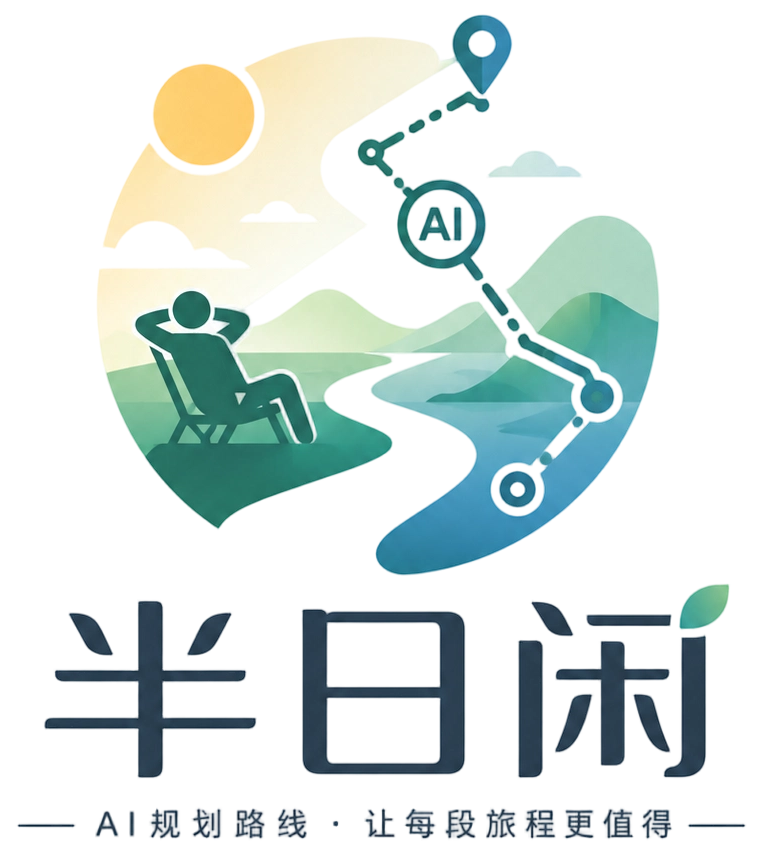
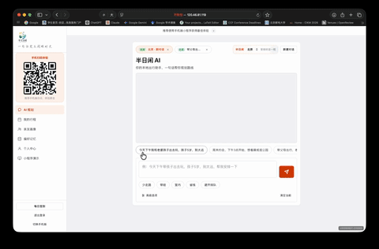
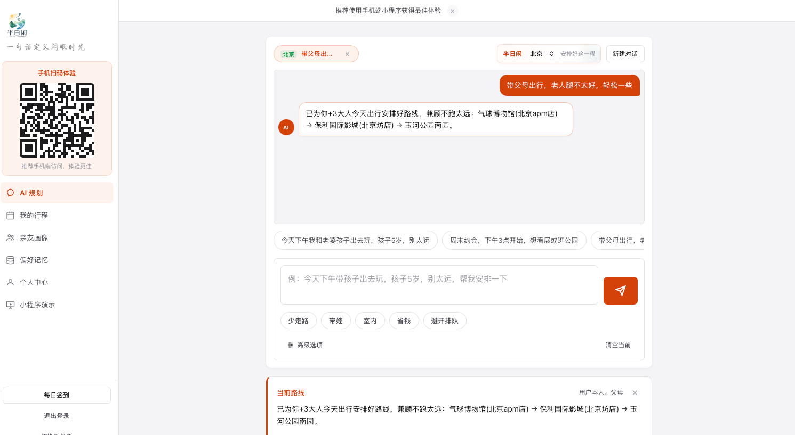
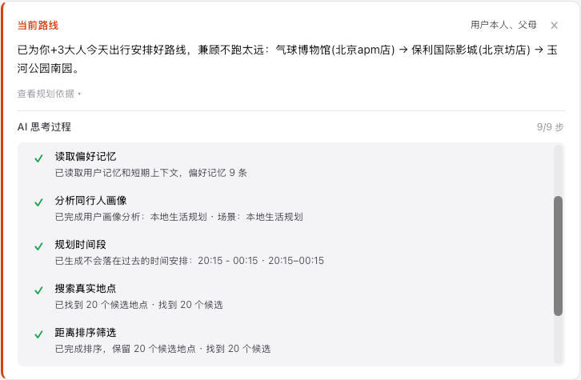
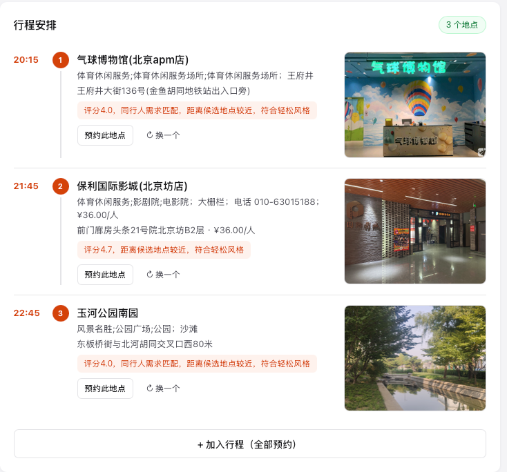
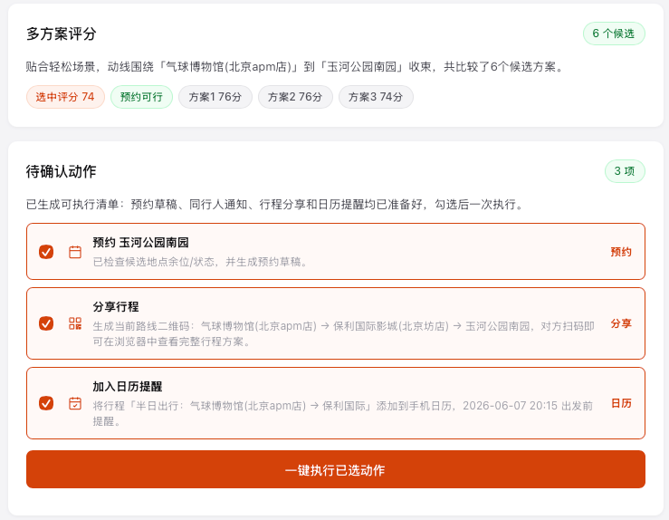
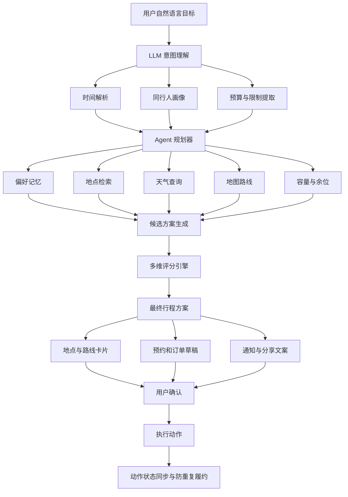
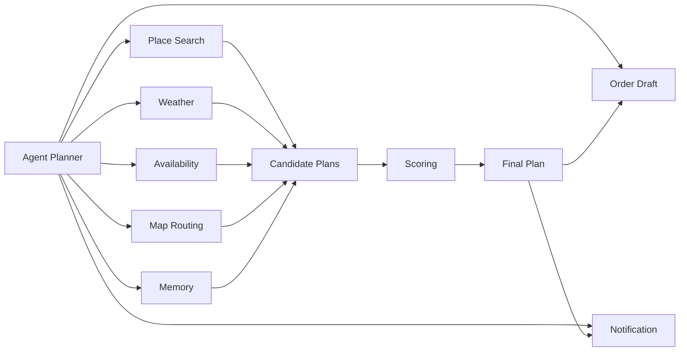

<p align="center">
  <picture>
    <source media="(prefers-color-scheme: dark)" srcset="./assets/main_logo.png">
    <source media="(prefers-color-scheme: light)" srcset="./assets/main_logo.png">
    
  </picture>
</p>

<h1 align="center">
  半日闲 AI
</h1>

<h2 align="center">
  <a href="http://120.46.81.119/" target="_blank">
    面向本地生活场景的短时活动执行 Agent
  </a>
</h2>

<h3 align="center">
  <a href="http://120.46.81.119/" target="_blank">
    “把一句想法，变成真正可以执行的半日生活方案”
  </a>
</h3>

<p align="center">
  <strong>
    Meituan Hackathon 2026 · 命题赛道赛题 6
  </strong>
</p>

---

<p align="center">
  <a href="https://www.python.org/">
    
  </a>
  <a href="https://fastapi.tiangolo.com/">
    
  </a>
  <a href="https://platform.openai.com/">
    
  </a>
  <a href="https://lbs.amap.com/">
    
  </a>
  <a href="https://github.com/yuanjianzhang0/banrixian">
    
  </a>
  <a href="https://github.com/yuanjianzhang0/banrixian">
    
  </a>
</p>

<p align="center">
  <a href="#-产品展示--product-showcase">产品展示</a>
  ·
  <a href="#-简介--introduction">项目简介</a>
  ·
  <a href="#-quickstart--快速开始">快速开始</a>
  ·
  <a href="#-核心优势--why-banrixian">核心优势</a>
  ·
  <a href="#-system-architecture--系统架构">系统架构</a>
  ·
  <a href="#-测试与验证--testing">测试验证</a>
</p>

---

## 📺 产品展示 / Product Showcase

<p align="center">
  
</p>

<p align="center">
  <strong>
    从自然语言需求输入，到路线规划、地点选择、预约草稿和同行人通知的一站式执行流程
  </strong>
</p>

<table align="center">
  <tr>
    <td align="center" width="50%">
      
      <br>
      <strong>需求输入与产品首页</strong>
    </td>
    <td align="center" width="50%">
      
      <br>
      <strong>Agent 实时规划过程</strong>
    </td>
  </tr>
  <tr>
    <td align="center" width="50%">
      
      <br>
      <strong>行程与执行动作卡片</strong>
    </td>
    <td align="center" width="50%">
      
      <br>
      <strong>分享与同行人通知</strong>
    </td>
  </tr>
</table>

<p align="center">
  <a href="./banrixian_web/appdix/设计文档.pdf">
    <strong>📄 查看完整设计文档</strong>
  </a>
  &nbsp;&nbsp;·&nbsp;&nbsp;
  <a href="https://github.com/yuanjianzhang0/banrixian">
    <strong>💻 查看 GitHub 仓库</strong>
  </a>
</p>

> 请将实际产品 GIF 和截图放入 `images/` 目录，或将上述图片路径修改为仓库中的真实路径。

---

## 📖 简介 / Introduction

**半日闲 AI** 是面向 **美团 Hackathon 2026 本地生活场景**开发的短时活动执行 Agent，对应命题赛道赛题 6。

传统本地生活产品通常只能解决“搜索什么”和“推荐哪里”的问题。用户仍然需要自己比较地点、检查天气、规划路线、确认时间、联系同行人，并分别完成预约或下单。

半日闲希望进一步解决：

> **用户提出一个目标后，如何把这个目标变成一套可以确认、可以执行、可以完成的本地生活方案。**

用户只需要输入一句自然语言需求，例如：

```text
明晚想和老婆出去放松一下。
她最近在减肥，不想吃太油。
预算控制在 500 元以内，也不想走太远。
```

半日闲会自动完成：

* 识别“明晚”对应的具体日期和时间段
* 提取同行人、预算、饮食和距离限制
* 读取用户历史偏好与家庭成员画像
* 检索适合的餐厅、展览、娱乐和休闲地点
* 检查天气、营业状态、容量和余位
* 生成多套候选活动方案
* 从时间、动线、预算和可执行性等维度评分
* 输出最终行程、路线和地点说明
* 生成预约、下单、通知和分享草稿
* 在用户确认后推进后续执行

<p align="center">
  
</p>

---

## 🎯 从推荐到执行 / From Recommendation to Execution

传统推荐系统的工作流程：

```text
用户输入需求
      ↓
搜索地点
      ↓
返回推荐列表
      ↓
用户自行比较和执行
```

半日闲 AI 的工作流程：

```text
用户输入自然语言目标
      ↓
解析时间、预算、同行人与偏好
      ↓
调用地点、天气、余位、地图和记忆工具
      ↓
生成多套候选活动方案
      ↓
综合评分并选择最稳方案
      ↓
生成完整路线和时间安排
      ↓
生成预约、订单、通知与分享草稿
      ↓
用户确认
      ↓
推进执行并同步动作状态
```

半日闲的输出不只是“推荐去哪里”，还会明确：

| 输出内容       | 说明                   |
| ---------- | -------------------- |
| 📍 去哪里     | 推荐地点、备选地点及选择原因       |
| ⏰ 什么时候去    | 出发时间、到达时间和建议停留时长     |
| 🗺️ 怎么走    | 地点顺序、路线距离和整体动线       |
| 🍽️ 吃什么    | 根据预算、饮食限制和同行人偏好选择    |
| 🎫 是否预约    | 判断门票、餐厅或活动是否需要提前预约   |
| 🛒 需要购买什么  | 生成门票、套餐或商品的下单草稿      |
| 💬 如何通知同行人 | 自动生成可以直接发送的行程通知      |
| ⚠️ 有什么风险   | 提示天气、余位、营业状态和第三方服务限制 |

---

## ✨ 核心能力 / Core Capabilities

<table>
  <tr>
    <td width="50%" valign="top">
      <h3>🎯 自然语言目标理解</h3>
      <p>
        支持“明晚”“这周六”“不要太远”“老婆减肥”
        “孩子喜欢恐龙”“朋友有人不吃辣”等模糊、口语化输入。
      </p>
    </td>
    <td width="50%" valign="top">
      <h3>👨‍👩‍👧 同行人画像分析</h3>
      <p>
        自动提取同行人的年龄、关系、兴趣、饮食禁忌、
        行动限制以及活动偏好。
      </p>
    </td>
  </tr>
  <tr>
    <td width="50%" valign="top">
      <h3>🗺️ 多候选方案规划</h3>
      <p>
        先生成多套可行路线，再比较不同组合，
        避免一次性生成结果带来的偶然性。
      </p>
    </td>
    <td width="50%" valign="top">
      <h3>📊 多维方案评分</h3>
      <p>
        从时间、预算、距离、动线、餐饮、天气、
        余位和整体可执行性等维度综合评分。
      </p>
    </td>
  </tr>
  <tr>
    <td width="50%" valign="top">
      <h3>🌦️ 真实工具链路</h3>
      <p>
        按需调用地点检索、地图路线、天气、
        容量余位、用户记忆、订单和通知等工具。
      </p>
    </td>
    <td width="50%" valign="top">
      <h3>🧠 偏好记忆</h3>
      <p>
        保存并复用用户的常用地点、预算范围、
        餐饮偏好、家庭成员偏好和出行习惯。
      </p>
    </td>
  </tr>
  <tr>
    <td width="50%" valign="top">
      <h3>🛒 执行动作草稿</h3>
      <p>
        自动整理预约、门票、商品、订单、
        分享和同行人通知等待确认动作。
      </p>
    </td>
    <td width="50%" valign="top">
      <h3>🛡️ 防重复履约</h3>
      <p>
        地点卡片和一键执行共用动作状态，
        避免相同餐厅、商品或通知被重复执行。
      </p>
    </td>
  </tr>
</table>

---

## 💡 使用场景 / Example Scenarios

### 👨‍👩‍👧 家庭周末

用户输入：

```text
这周六带老婆和孩子出去玩。
孩子最近特别喜欢恐龙。
老婆在减肥，不想吃太油。
```

半日闲可以生成：

* 适合儿童的恐龙主题场馆
* 根据天气确定室内或室外方案
* 场馆附近的轻食或低脂餐厅
* 场馆与餐厅之间的路线
* 门票和餐厅预约草稿
* 可以直接发给家人的行程通知

---

### 💑 情侣约会

用户输入：

```text
明晚两个人约会。
预算在 500 元以内。
不要太远，最好吃完饭还能散步。
```

半日闲可以生成：

* 距离和预算合适的餐厅
* 餐后散步、夜景或甜品地点
* 每个地点的建议停留时间
* 完整路线和总预算估算
* 餐厅预约草稿
* 可直接分享的约会安排

---

### 👥 朋友聚会

用户输入：

```text
周五晚上四个人聚会。
有人不吃辣。
最好还能安排一个饭后活动。
```

半日闲可以生成：

* 满足饮食限制的餐厅
* 四人可用的容量或余位信息
* 饭后娱乐或休闲地点
* 完整时间安排和移动路线
* 群聊通知文案
* 待确认的预约与执行草稿

---

## 🛠️ Installation / 环境安装

项目后端基于 **FastAPI** 构建，支持本地规则模式和 LLM 模式。

建议使用 Python 3.10 或更高版本。

首先，克隆仓库并进入项目目录：

```bash
git clone https://github.com/yuanjianzhang0/banrixian.git
cd banrixian
```

创建并激活虚拟环境：

```bash
conda create -n banrixian python=3.10
conda activate banrixian
```

也可以使用 Python 自带的虚拟环境：

```bash
python -m venv .venv

# macOS / Linux
source .venv/bin/activate

# Windows
.venv\Scripts\activate
```

安装项目依赖：

```bash
pip install -r requirements.txt
```

---

## 🔐 Environment Variables / 环境变量

项目支持本地规则和 LLM 两种运行模式。

在项目根目录创建 `.env` 文件：

```env
LLM_PROVIDER=local

OPENAI_API_KEY=YOUR_MODEL_SERVICE_KEY

AMAP_WEB_API_KEY=YOUR_AMAP_WEB_API_KEY
AMAP_API_KEY=YOUR_AMAP_SERVICE_KEY
```

环境变量说明：

| 环境变量               | 说明                   |
| ------------------ | -------------------- |
| `LLM_PROVIDER`     | 模型运行模式或模型服务提供方       |
| `OPENAI_API_KEY`   | OpenAI 兼容模型服务的访问 Key |
| `AMAP_WEB_API_KEY` | 高德地图 Web 端 API Key   |
| `AMAP_API_KEY`     | 高德地图服务端 API Key      |

> 不要把真实 API Key 提交到公开仓库。建议同时在 `.gitignore` 中加入 `.env`。

---

## 🚀 Quickstart / 快速开始

完成依赖安装和环境变量配置后，在项目根目录运行：

```bash
python main.py
```

默认启动 FastAPI 后端服务。

启动成功后，可以访问：

```text
产品首页：/
产品 Demo：/app
设计文档：/appdix/设计文档.pdf
```

如果使用 Nginx 部署静态网页，可以将：

```text
banrixian_web/
```

同步到站点目录，并参考：

```text
nginx/banrixian-web.conf
```

完成反向代理与静态资源配置。

<p align="center">
  
</p>

---

## 🧠 Agent Planning / 规划流程

半日闲并不是一次性让模型直接生成最终答案，而是采用分阶段的 Agent 规划流程。

### 1. 用户目标拆解

从用户输入中提取：

* 活动日期与时间
* 活动时长
* 出发位置
* 预算范围
* 同行人关系
* 同行人兴趣
* 饮食限制
* 距离要求
* 特殊需求

### 2. 相对时间校准

将自然语言中的相对时间转换为明确日期，例如：

```text
明晚
这周六
下周末
今晚下班后
```

时间解析结果会被用于天气、营业状态、余位和路线规划。

### 3. 用户偏好读取

系统会根据当前需求读取相关记忆，例如：

* 用户常用出发地点
* 喜欢或不喜欢的餐饮类型
* 常见活动预算
* 家庭成员兴趣
* 可接受的通勤距离
* 历史活动选择

### 4. 工具按需调用

Agent 根据需求选择需要调用的工具：

```text
地点检索
天气查询
地图与路线
容量与余位
用户记忆
订单草稿
短信与通知
分享文案
```

### 5. 多候选方案生成

系统生成多套候选方案，而不是直接输出第一套结果。

候选方案可能在以下方面有所不同：

* 地点组合
* 出发时间
* 餐厅选择
* 路线顺序
* 活动类型
* 预算分配
* 室内或室外安排

### 6. 多维评分

候选方案会根据多个维度进行综合评估：

```text
综合评分 =
时间匹配度
+ 动线合理性
+ 距离适配度
+ 预算匹配度
+ 餐饮匹配度
+ 同行人偏好匹配度
+ 天气适应性
+ 余位与营业状态
+ 整体可执行性
```

### 7. 最终方案定稿

评分完成后，Agent 选择整体风险最低、体验最稳定的方案，并生成：

* 完整时间线
* 地点说明
* 选择原因
* 路线信息
* 预算估算
* 注意事项
* 备选方案

### 8. 执行动作生成

最终方案会进一步转化为待确认动作：

* 餐厅预约草稿
* 门票购买草稿
* 商品下单草稿
* 同行人通知
* 行程分享文案

### 9. 用户确认后执行

涉及预约、购买、发送通知等动作时，系统不会未经许可直接执行。

用户确认后，系统才会推进相应操作。

---

## 🛡️ Execution Safety / 执行安全

本地生活 Agent 涉及预约、下单和消息通知，因此半日闲设计了多层执行保护。

| 安全机制        | 作用                     |
| ----------- | ---------------------- |
| ✅ 用户确认      | 真实预约、下单或通知前必须得到用户确认    |
| 🔄 动作状态共享   | 地点卡片和一键执行使用同一动作状态      |
| 🚫 防重复提交    | 避免相同地点、商品或通知被执行多次      |
| 🔍 工具结果校验   | 根据工具真实返回更新状态，不伪造成功结果   |
| 🌦️ 超时降级    | 天气或第三方服务异常时使用明确提示或降级方案 |
| 📱 短信合规提示   | 非企业认证环境不伪造短信发送结果       |
| 🔐 登录异常处理   | 对验证码、登录失效和权限问题提供明确反馈   |
| 📡 SSE 状态展示 | 实时展示规划、工具调用和方案生成阶段     |

---

## 🧱 System Architecture / 系统架构



---

## 🔧 Tool Chain / 工具调用链路



主要工具包括：

| 工具     | 作用                   |
| ------ | -------------------- |
| 地点工具   | 检索餐厅、景点、展览、娱乐和本地生活服务 |
| 天气工具   | 查询指定时间与地点的天气状况       |
| 地图工具   | 计算地点距离、路线和移动时间       |
| 余位工具   | 检查地点容量、余位或可预约状态      |
| 记忆工具   | 读取和更新用户长期偏好          |
| 订单工具   | 生成预约、门票和商品订单草稿       |
| 通知工具   | 生成同行人短信、群聊和分享文案      |
| SSE 工具 | 向前端实时返回 Agent 规划进度   |

---

## 📂 Project Structure / 项目架构树

本项目按照后端接口、Agent、工具、前端与测试模块进行组织：

```text
banrixian/
├── 📄 main.py
│   └── FastAPI 应用入口与服务启动配置
│
├── 📁 agent/
│   ├── Agent 规划器
│   ├── 系统提示词
│   ├── LLM 客户端
│   ├── 工具注册与调用
│   ├── 候选方案生成
│   ├── 多维评分逻辑
│   ├── 本地测试工具
│   └── README_AGENT.md
│
├── 📁 routers/
│   ├── 认证与登录 API
│   ├── 对话与 Agent API
│   ├── 地图与路线 API
│   ├── 用户记忆 API
│   ├── 订单与预约 API
│   ├── 通知 API
│   └── 分享 API
│
├── 📁 skills/
│   ├── 天气工具
│   ├── 短信与通知工具
│   ├── 用户记忆工具
│   └── Agent 运行时工具封装
│
├── 📁 banrixian_web/
│   ├── 产品官网
│   ├── Web Demo
│   ├── 静态资源
│   └── 📁 appdix/
│       └── 设计文档.pdf
│
├── 📁 static/
│   └── 📁 place_images/
│       └── 本地场景图片缓存
│
├── 📁 scripts/
│   ├── 路线规划质量测试
│   ├── 系统端到端测试
│   ├── 地点数据导入
│   └── 其他测试与维护脚本
│
├── 📁 test_logs/
│   ├── route_planning_quality_20260602.md
│   └── system_e2e_20260602.md
│
├── 📁 nginx/
│   └── banrixian-web.conf
│
├── 📁 assets/
│   ├── main_logo.png
│   └── slogan.png
│
├── 📄 TEST_REPORT_20260602.md
├── 📄 requirements.txt
└── 📄 README.md
```

---

## 🧪 测试与验证 / Testing

项目包含路线规划质量测试和系统端到端测试。

运行路线规划质量测试：

```bash
python scripts/run_route_quality_tests.py
```

运行系统端到端测试：

```bash
python scripts/run_system_e2e_tests.py
```

测试报告位于：

```text
TEST_REPORT_20260602.md
test_logs/route_planning_quality_20260602.md
test_logs/system_e2e_20260602.md
```

主要测试内容包括：

| 测试类别      | 验证内容                   |
| --------- | ---------------------- |
| 时间解析测试    | “明晚”“周末”等相对时间能否正确解析    |
| 偏好识别测试    | 饮食、预算、距离和同行人限制能否准确提取   |
| 路线质量测试    | 地点顺序、移动距离和时间安排是否合理     |
| 工具调用测试    | 天气、地点、余位、订单和通知工具能否正常调用 |
| 异常降级测试    | 第三方接口超时或失败时是否正确降级      |
| 防重复测试     | 预约、下单和通知是否会被重复执行       |
| 系统 E2E 测试 | 从用户输入到最终方案生成的完整链路      |

---

## ✨ Why Banrixian? / 核心优势

* **🎯 从搜索推荐升级为任务执行**

  半日闲不只返回地点列表，而是将地点、时间、路线、预算、预约和同行人通知组织为完整方案。

* **🧠 理解真实生活中的模糊表达**

  用户不需要填写复杂表单，可以直接使用“明晚”“别太远”“孩子喜欢恐龙”等自然表达。

* **📊 多方案生成与综合评分**

  系统不会简单采用模型生成的第一套答案，而是生成多套候选方案并进行比较。

* **🌦️ 接入真实本地生活工具**

  地点、天气、地图、余位、订单、通知和记忆共同构成可执行工具链。

* **🛡️ 用户确认与防重复履约**

  真实动作由用户确认后执行，同时通过共享状态避免重复预约、下单和通知。

* **📡 可视化 Agent 规划过程**

  基于 SSE 实时展示 Agent 当前正在进行的分析、工具调用和方案生成阶段。

* **🧩 支持本地规则与 LLM 双模式**

  在模型服务不可用或比赛现场网络受限时，可以通过本地规则和降级策略保障核心 Demo 流程。

* **🏆 面向比赛展示优化**

  项目包含产品官网、Web Demo、设计文档、测试报告和 Agent 设计说明，方便评委快速理解和验证。

---

## ⚠️ 异常处理 / Failure Handling

半日闲针对比赛现场和真实服务中的常见异常进行了处理：

### 天气服务异常

当天气接口超时或不可用时：

* 明确提示天气数据暂不可用
* 降低户外方案优先级
* 保留室内备选方案
* 不伪造天气查询结果

### 余位或容量数据不可用

当无法获得实时余位时：

* 将状态标记为“需要确认”
* 提供备选地点
* 不将未知余位展示为可预约

### 短信接口受限

非企业认证场景下：

* 只生成待发送通知文案
* 展示短信服务的合规限制
* 不伪造短信发送成功状态

### 登录或验证码异常

系统会针对：

* 验证码错误
* 登录状态失效
* 权限不足
* 请求频率过高

返回明确提示，并保留用户当前方案。

### 重复操作

通过共享动作状态避免：

* 同一餐厅被重复预约
* 同一商品被重复下单
* 同一同行人收到重复通知

---

## 🗺️ Roadmap / 开发计划

* [x] 自然语言活动目标理解
* [x] 相对时间解析
* [x] 同行人画像提取
* [x] 用户偏好记忆
* [x] 多候选方案生成
* [x] 多维方案评分
* [x] 地点检索与路线规划
* [x] 天气工具接入
* [x] 容量与余位判断
* [x] 预约和订单草稿
* [x] 通知与分享文案
* [x] SSE 流式规划过程
* [x] 防重复履约机制
* [x] 路线质量与系统 E2E 测试
* [ ] 接入更多真实本地生活服务
* [ ] 增加交通拥堵与排队时间预测
* [ ] 支持多人共同编辑活动方案
* [ ] 增加活动结束后的反馈学习
* [ ] 支持更完整的移动端应用
* [ ] 支持多城市和跨城市短途规划

---

## 📄 Design Documents / 设计文档

完整 Agent 设计说明位于：

```text
agent/README_AGENT.md
```

完整产品设计文档位于：

```text
banrixian_web/appdix/设计文档.pdf
```

设计文档重点包括：

* 自然语言目标拆解
* 相对时间校准
* 同行人画像提取
* 偏好记忆读取
* 工具选择与调用
* 多候选方案生成
* 多维评分机制
* 最终方案定稿
* 预约与订单草稿生成
* 用户确认与动作执行
* 第三方服务异常降级
* 防重复履约设计
* SSE 过程可视化

---

## 🧰 Tech Stack / 技术栈

| 层级       | 技术与实现                              |
| -------- | ---------------------------------- |
| Web 后端   | FastAPI                            |
| Agent 核心 | 自定义 Planner、Prompt 和 Tool Registry |
| 模型服务     | OpenAI 兼容接口或本地模型服务                 |
| 地图服务     | 高德地图 API                           |
| 实时通信     | Server-Sent Events                 |
| 前端页面     | HTML、CSS、JavaScript                |
| 用户记忆     | 本地记忆模块与偏好存储                        |
| 地点资源     | 地点数据库与本地场景图片缓存                     |
| 部署方式     | Python 服务、静态网页与 Nginx              |
| 测试体系     | 路线质量测试与系统 E2E 测试                   |

---

## 🤝 Contributing / 参与贡献

欢迎通过 Issue 或 Pull Request 参与项目建设。

建议贡献流程：

```bash
# Fork 本仓库后克隆
git clone https://github.com/YOUR_USERNAME/banrixian.git

# 创建功能分支
git checkout -b feature/your-feature

# 提交代码
git add .
git commit -m "feat: add your feature"

# 推送分支
git push origin feature/your-feature
```

提交 Pull Request 时，请说明：

* 修改目的
* 主要实现方式
* 是否涉及接口变化
* 是否补充测试
* 是否影响现有 Demo 流程

---

## 📌 项目信息 / Project Information

| 项目   | 内容                         |
| ---- | -------------------------- |
| 项目名称 | 半日闲 AI                     |
| 项目类型 | 本地生活短时活动执行 Agent           |
| 比赛   | 美团 Hackathon 2026          |
| 赛道   | 命题赛道赛题 6                   |
| 仓库   | `yuanjianzhang0/banrixian` |
| 核心理念 | 从推荐走向执行                    |
| 当前状态 | 产品 Demo 与测试链路已完成           |

---

## 📜 License / 开源协议

请根据项目实际使用的开源协议补充 `LICENSE` 文件。

例如：

```text
MIT License
Apache License 2.0
```

添加协议文件后，可以在顶部徽章区域增加：

```html
<a href="./LICENSE">
  
</a>
```

---

## ⭐ Support / 支持项目

如果半日闲 AI 对你的项目、比赛或 Agent 开发有所帮助，欢迎为仓库点一个 Star。

<p align="center">
  <a href="https://github.com/yuanjianzhang0/banrixian">
    
  </a>
  <a href="https://github.com/yuanjianzhang0/banrixian/fork">
    
  </a>
</p>

<p align="center">
  <strong>
    半日闲 AI —— 帮用户把本地生活中的事情真正做完。
  </strong>
</p>
